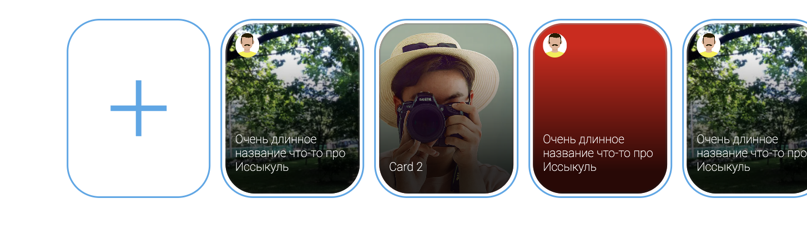
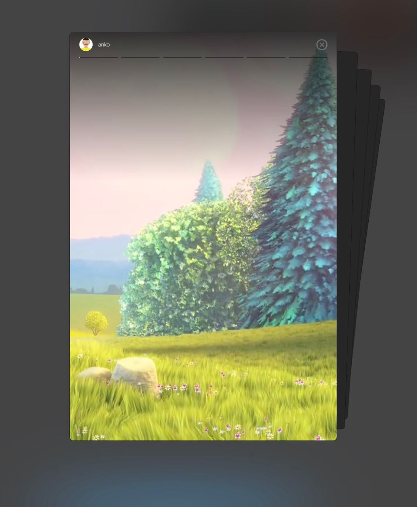

# Reels or shorts modal slider

Instagram or youtube reels slider





## Usage

 ```
 <div id="modals"></div>

  <ReelsSection
    :reelsSlides="listSlides"
    :creationMode="true"
    createLink="https://www.youtube.com/watch?app=desktop&v=vkAsNffJ_ZY&ab_channel=%D0%9F%D1%80%D0%BE%D1%81%D1%82%D0%BE%D0%BELaravel.CutCode"
  />
  <ReelsSection :reelsSlides="[]" />
```
## Recommended IDE Setup

- [VS Code](https://code.visualstudio.com/) + [Volar](https://marketplace.visualstudio.com/items?itemName=Vue.volar) (and disable Vetur) + [TypeScript Vue Plugin (Volar)](https://marketplace.visualstudio.com/items?itemName=Vue.vscode-typescript-vue-plugin).
